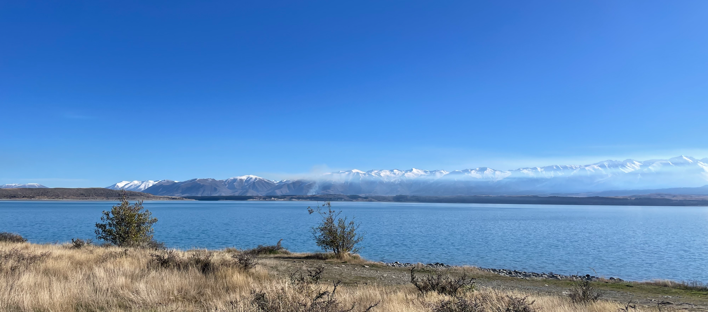

## 🙋‍♂️ About me

- QA engineering professional with 5+ years of experience in software and security testing, specializing in end-to-end automation, quality assurance, and continuous improvement across the full software development lifecycle, including developing course materials and delivering hands-on lab training.
- Experienced in developing customized training materials and delivering hands-on lab sessions for testers and engineers, with proven expertise in creating comprehensive course content and conducting practical workshops to help teams upskill in automation, DevOps, and security best practices.
- ISTQB Advanced Level–certified professional, skilled at independently leading all aspects of testing beyond development—including DevOps, DevSecOps, and SRE testing—by applying robust Shift-Left and Shift-Right strategies to optimize quality throughout the development pipeline.
- AWS Solutions Architect certified with hands-on expertise in Azure and a proven ability to adapt and expand into all areas of DevOps engineering through continuous learning and professional development initiatives.

## 📝 Key Technical Skills

- **Test Automation**:
    - Selenium, Playwright, Cucumber (BDD), Appium, K6, Postman, JavaScript, Python
- **Test Management & Reporting**:
    - Qase, TestRail, Jira, Allure, Cucumber Reports
- **CI/CD & DevOps**:
    - Jenkins, GitHub Actions, Azure DevOps, Docker, Kubernetes, Terraform, Ansible
- **Security & Compliance**:
    - OWASP ZAP, Burp Suite, NZISM, PCI-DSS, OWASP Top 10 (Web & API)
- **Cloud & Monitoring**:
    - AWS, Microsoft Azure, ELK Stack, Prometheus, Grafana
- **Version Control & Collaboration**:
    - Git, GitHub, GitLab, Github Flow branch strategy
