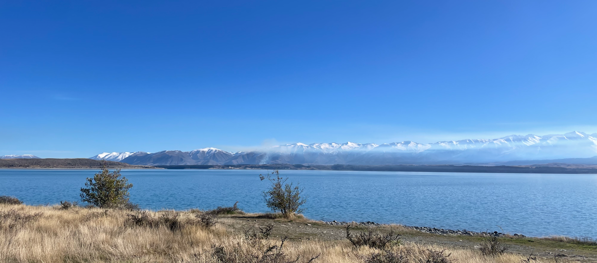

## About me

- QA engineering professional with 5+ years of experience in software and security testing, specializing in end-to-end automation, quality assurance, and continuous improvement across the full software development lifecycle, including developing course materials and delivering hands-on lab training.
- Experienced in developing customized training materials and delivering hands-on lab sessions for testers and engineers, with proven expertise in creating comprehensive course content and conducting practical workshops to help teams upskill in automation, DevOps, and security best practices.
- ISTQB Advanced Level–certified professional, skilled at independently leading all aspects of testing beyond development—including DevOps, DevSecOps, and SRE testing—by applying robust Shift-Left and Shift-Right strategies to optimize quality throughout the development pipeline.
- AWS Solutions Architect certified with hands-on expertise in Azure and a proven ability to adapt and expand into all areas of DevOps engineering through continuous learning and professional development initiatives.

## Key Technical Skills

- **Test Automation**:
    - Selenium, Playwright, Cucumber (BDD), Appium, K6, Postman, JavaScript, Python
- **Test Management & Reporting**:
    - Qase, TestRail, Jira, Allure, Cucumber Reports
- **CI/CD & DevOps**:
    - Jenkins, GitHub Actions, Azure DevOps, Docker, Kubernetes, Terraform, Ansible
- **Security & Compliance**:
    - OWASP ZAP, Burp Suite, NZISM, PCI-DSS, OWASP Top 10 (Web & API)
- **Cloud & Monitoring**:
    - AWS, Microsoft Azure, ELK Stack, Prometheus, Grafana
- **Version Control & Collaboration**:
    - Git, GitHub, GitLab, Github Flow branch strategy
- **AI Testing (RAG & Agentic AI)**:
    - LangChain Evaluation, TruLens, DeepEval, MLflow, Weights & Biases, Pinecone, Weaviate, ChromaDB
 
## Resources

- [Software Testing Strategies and Plans](https://github.com/sec-ekang/qa_frameworks/tree/main/test-docs)
- [Functional Testing Guides](https://github.com/sec-ekang/qa_frameworks/tree/main/functional-test)
- [Non-Functional Testing Guides](https://github.com/sec-ekang/qa_frameworks/tree/main/non-functional-test)
- [Automation Testing Framewoks](https://github.com/sec-ekang/qa_frameworks/tree/main/framework-examples)
- [CI/CD Pipleline Example](https://github.com/sec-ekang/modern-devops-practices/tree/main/ci-cd)
- [AWS Cloud Architecture](https://github.com/sec-ekang/modern-devops-practices/tree/main/cloud-architecture/aws)
- [Azure Cloud Architecture](https://github.com/sec-ekang/modern-devops-practices/tree/main/cloud-architecture/azure)
- [Infrastructure as Code: Terraform and Ansible](https://github.com/sec-ekang/modern-devops-practices/tree/main/infrastructure)
- [Docker: Dockerfiles, Docker-Compose](https://github.com/sec-ekang/modern-devops-practices/tree/main/docker)
- [Kubernetes: Manifest, Helm, Kustomize, Istio, Logging & Monitoring](https://github.com/sec-ekang/modern-devops-practices/tree/main/kubernetes) 
- [DevOps Guide Docs](https://github.com/sec-ekang/modern-devops-practices/tree/main/docs)
- [Cloud Security Testing](https://github.com/sec-ekang/security-test_frameworks/tree/main/cloud-security)
- [API Security Testing](https://github.com/sec-ekang/security-test_frameworks/tree/main/api-security-test)
- [Web Application Security Testing](https://github.com/sec-ekang/security-test_frameworks/tree/main/web-security-test)
- [Security Compliance Testing](https://github.com/sec-ekang/security-test_frameworks/tree/main/security-compliances)
- [AI Testing Frameworks and Guides](https://github.com/sec-ekang/ai-test_frameworks)

## Mentorship notes (Theory & Practice)

- [DevOps Foundation](https://cold-buffet-8c8.notion.site/DevOps-Foundation-1bfa6d8427b280ccba7fe6321c4ab54e)
- [DevOps Advanced](https://cold-buffet-8c8.notion.site/DevOps-Advanced-1f0a6d8427b28026bf8ecca1f2158975)
